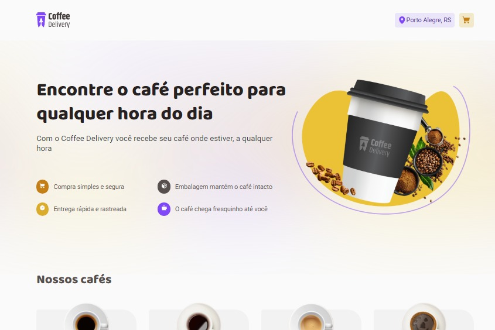

<p align="center">

</p>

## Sobre o Projeto

Coffee é uma SPA simples de um delivery de café.

Desenvolvido como desafio no curso de ReactJS da RocketSeat.

## Tecnologias

Lista de tecnologias utilizadas no projeto:

- React
- TypeScript
- Styled Components

## Executando o projeto

1. Clone o repositório e instale as dedependências:

```bash
$ git clone https://github.com/transformacaodev/bitcent
$ cd coffee-delivery
$ npm install
```

2. Comandos

```bash
$ npm run dev
$ npm run build
$ npm run lint
```

## License

Esse projeto está sob a [licença MIT](LICENSE.md).
